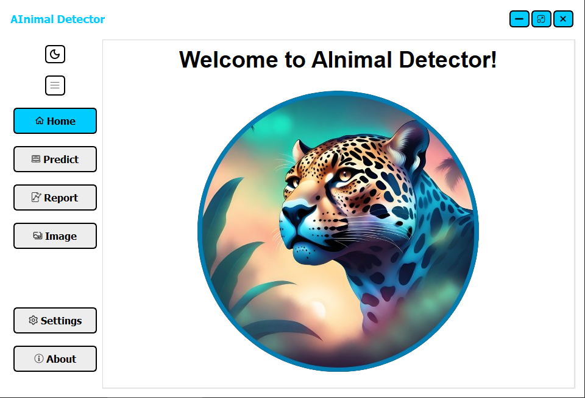
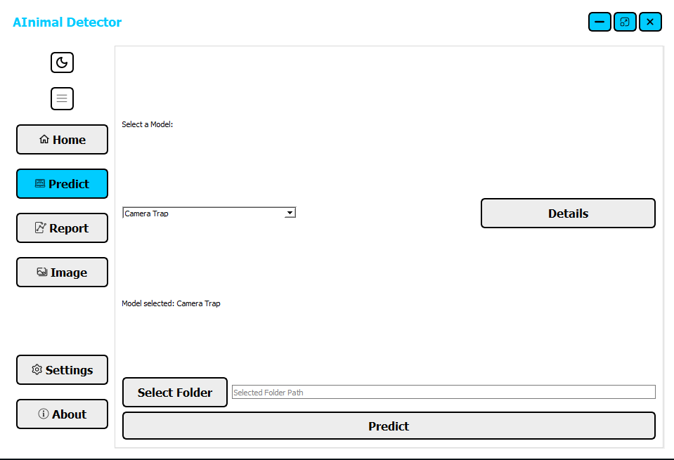
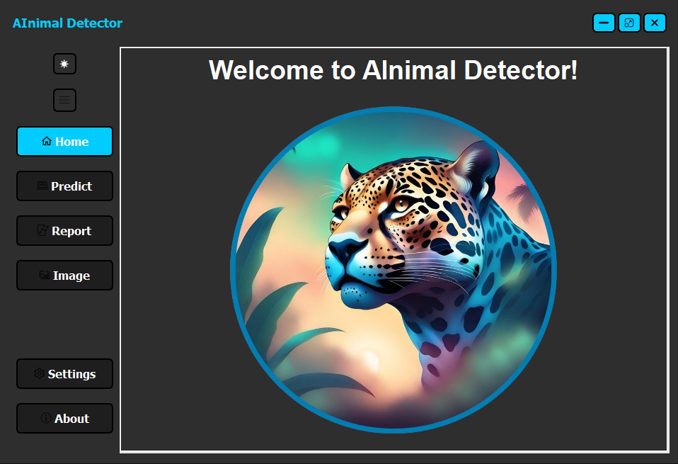

# AInimal Detector

## Overview

AInimal Detector is an innovative project that employs deep learning with YOLO (You Only Look Once) to effectively detect animals in images and videos. Specifically designed to support researchers in fields requiring animal detection, such as camera traps, this project is actively contributing to a Master's project at UFJF (Universidade Federal de Juiz de Fora).



## Features

- **Animal Detection:** Utilizes YOLO to accurately identify and locate animals in images and videos.
- **User Interface:** Built with PyQt, providing an intuitive and interactive experience for users.
- **Multi-platform Support:** Compatible with various platforms, ensuring accessibility for a broad audience.
- **Easy Integration:** Simple and straightforward integration with your existing workflow.



> **Description:** This is a screenshot of the Predict page in the light theme. It shows the user interface for making predictions with the AInimal Detector.


## Requirements

- Python 3.x
- YOLO (You Only Look Once)
- PyQt5
- OpenCV
- Other dependencies (refer to the requirements.txt file)

## Installation

1. Clone the repository:

   ```bash
   git clone https://github.com/PauloCareli/ainimal-detector.git

## Install the required dependencies:

1. Clone the repository:

   ```bash
   git clone https://github.com/PauloCareli/ainimal-detector.git

2. To install all dependencies needed to run this project, first install **[Python]** and then **[Pip]** if it isn't installed yet. After that, run the line below with the terminal inside the root folder:

[Python]: https://www.python.org/downloads/
[Pip]: https://phoenixnap.com/kb/install-pip-windows

Then, run the following command:

   ```bash
   pip install -r requirements.txt
   ```

## Usage

1. You can install the application by clicking on the installer at
or you can run the AInimal Detector application with:

   ```bash
   python pyqt/main.py

2. Use the user-friendly interface to load images or videos and initiate the animal detection process.

## Configuration
Modify the configuration parameters in the config.py file to tailor the application to your specific needs.

## Themes

The application supports multiple themes to improve user experience. You can switch between the **Light** and **Dark** themes to suit your preference.

### Light Theme

The **Light theme** provides a bright and clean interface, ideal for well-lit environments.


### Dark Theme

The **Dark theme** offers a darker, more subdued interface, making it easier on the eyes in low-light conditions.



To switch between themes, simply click on the sun/moon icon.


## License
This project is licensed under the terms of the **GNU General Public License v3.0**.

You can find the full text of the license in the [LICENSE](./LICENSE) file.

For more details on the terms and conditions, see the [GNU General Public License](https://www.gnu.org/licenses/gpl-3.0.html).

## Acknowledgments
- YOLO (You Only Look Once): YOLO Website
- PyQt: PyQt Documentation
- OpenCV: OpenCV Documentation

Feel free to reach out if you have any questions or issues. Happy detecting! 🐾

